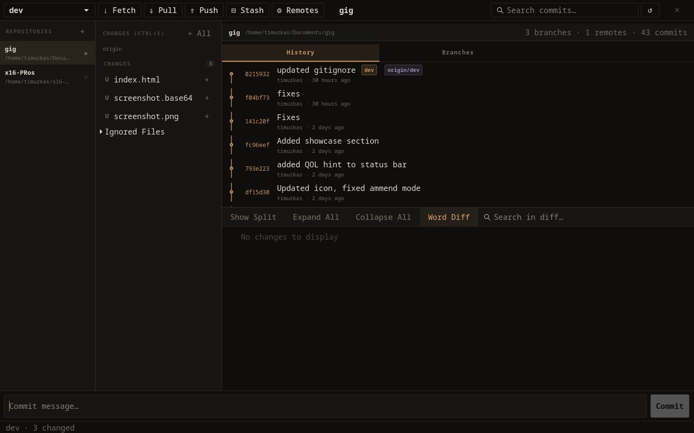

#  gig

A minimalist GTK4 Git client for keyboard-centric workflows.

- Fast split and unified diff viewing
- Full keyboard shortcut support (customizable)
- Multi-repository sidebar
- Stash management and conflict resolution
- TOML-based configuration (~/.config/gig/config.toml)

## Keybindings

All shortcuts are fully configurable in `~/.config/gig/config.toml`. Press `Ctrl + H` within the application to open the hotkeys help panel.

## Build

Requirements: Go 1.25+, GTK 4.x, pkg-config.

```bash
go build -o gig .
```


## Showcase



## License
MIT
